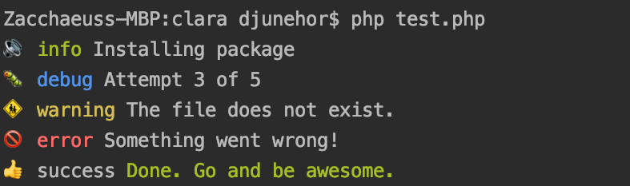
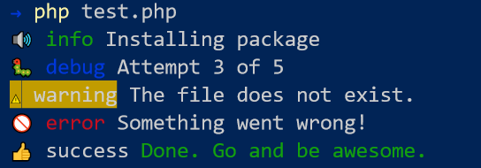
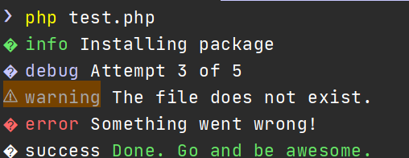

# clara 

[](https://packagist.org/packages/shalvah/clara) [](https://packagist.org/packages/shalvah/clara)

Simple, pretty console output for PHP CLI apps.

<p align="center">





</p>

## Installation
(PHP 7.2+)

```bash
composer require shalvah/clara
```

## Usage
```php
<?php

use Shalvah\Clara\Clara;

Clara::info("Installing package");
Clara::debug("Attempt 3 of 5");
Clara::warn("The file does not exist.");
Clara::error("Something went wrong!");
Clara::success("Done. Go and be awesome.");
```

The output will be coloured and presented as in the screenshot shown above.

If you'd like to output a line of text without the extra formatting provided by the functions above, you can use the `output()` function instead.

You can also mute and unmute the output by using `Clara::mute()` and `Clara::unmute()`. This can be useful if you;d like to reduce CLI noise when running your tests. The output will always be returned, so you can still assert on that.

## Note on emoji support
Some environments (example: Windows console) don't have proper support for Unicode, so emojis may not display properly.



